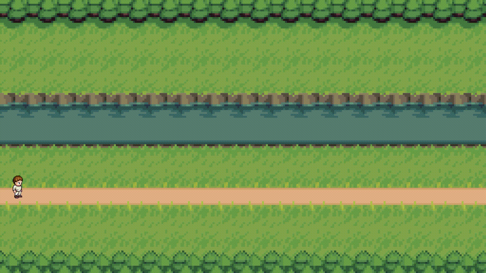

# GameStation

This **demo project** is my first attempt at creating a **2D-Game** from scratch.

General purpose of this endeavor is to test already learned concepts and experiment with different design patterns.

---

---
>Please **be aware** that since this project is intended as a learning experience, the **engine is prone to changes** of basic structures (e.g. GUI-framework etc.) in the future.
---

## Features
- Dynamic sprite loading (import of new maps / tiles / char-sprites)
- Adjustable tile-size / aspect-ratio / frames-per-second
- Dynamic animation based on the amount of imported sprites and movement / animation speed
- Collision detection system
- 3 different movement speeds
- Camera control system (rpg-style fixed camera)

## Roadmap
- Interactive in-game objects
- Persistence (config / save files)
- Inventory and in-game-menu system
- HUD
- Sound handling
- NPC and combat system
- Rendering performance optimization

---
>Movement: **W/A/S/D** or **UP/LEFT/DOWN/RIGHT**

>Toggle sneaking: **CTRL**

>Toggle running: **SHIFT**
---

**CREDITS**

Character sprites from [Universal LPC Spritesheet Generator](https://sanderfrenken.github.io/Universal-LPC-Spritesheet-Character-Generator/) *by Stephen Challener "Redshrike" and Johannes Sjölund "wulax"*

Map tile sprites from [OpenGameArt](https://opengameart.org/content/overworld-grass-biome) *by "Beast"*

